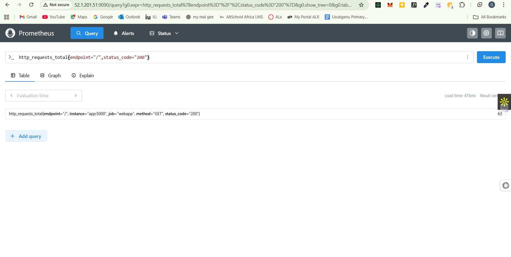
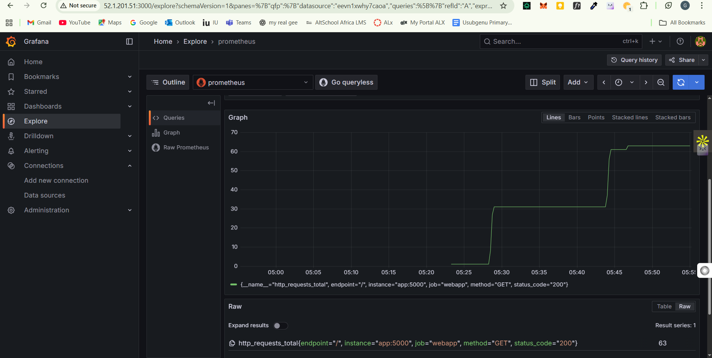

# Web Monitoring Stack

This project is a simple web application I set up to practice monitoring, troubleshooting, and alerting. I deployed a small Python/Flask web app with two endpoints – one for normal requests and one for health checks. Then I connected it with Prometheus and Grafana to collect and visualize metrics.

For example, Prometheus scrapes data like the number of HTTP requests, response times, and error rates. Grafana then shows those metrics on a live dashboard. To simulate real-world traffic, I wrote a script that sends repeated HTTP requests so I can see how the system behaves under load.

If the app slows down or errors increase, I can immediately see it on Grafana and even configure alerts. This aligns directly with Moniepoint’s role because it shows my ability to research, diagnose, and troubleshoot issues quickly using metrics and logs. It’s basically a small-scale version of how you’d monitor critical financial applications

This project provides a simple web monitoring stack using Flask, Prometheus, and Grafana. It allows you to monitor a demo web application and visualize metrics.


## Project Structure

- `app/` - Flask web application with Prometheus metrics
- `prometheus/` - Prometheus configuration
- `scripts/` - Utility scripts for starting the stack and generating traffic
- `docker-compose.yml` - Docker Compose setup for all services

## Getting Started

### Prerequisites

- Docker
- Docker Compose

### Setup

1. **Start the stack:**

   Run the setup script:

   ```sh
   ./scripts/script.sh
   ```

   This will start the following services:
   - **Web App:** [http://localhost:5000](http://localhost:5000)
   - **Prometheus:** [http://localhost:9090](http://localhost:9090)
   - **Grafana:** [http://localhost:3000](http://localhost:3000) (login: admin/admin)

2. **Generate traffic for metrics:**

   ```sh
   ./scripts/traffic.sh
   ```

   This will send requests to the web app endpoints to populate metrics.

## Endpoints

- `/` - Home page
- `/api/health` - Health check (occasionally returns error)
- `/metrics` - Prometheus metrics
- `/check-website?url=<URL>` - Check external website status

## Monitoring

- **Prometheus** scrapes metrics from the web app at `/metrics`.
- **Grafana** can be used to visualize metrics (configure Prometheus as a data source).

## 📊 Grafana Setup Cheat Sheet

### 1. Add Data Source

- Go to: `http://YOUR_EC2_IP:3000`
- Login: `admin/admin`
- Click: **Connections** → **Data Sources** → **Add new data source**
- Choose: **Prometheus**
- URL: `http://prometheus:9090`
- Click: **Save & test**

### 2. Import Dashboard

- Click: **+** → **Import**
- Use this ID: `13666`
- Select: **Prometheus** as data source
- Click: **Import**

### 3. Key Metrics to Show

```prometheus
# Visitors right now
rate(http_requests_total[1m])

# Error rate
rate(http_requests_total{status_code=~"5.."}[5m])

# Response speed
histogram_quantile(0.95, rate(http_request_duration_seconds_bucket[5m]))

```

)
## Configuration

- Prometheus config: [`prometheus/prometheus.yml`](prometheus/prometheus.yml)
- Docker Compose: [`docker-compose.yml`](docker-compose.yml)
- Flask app: [`app/app.py`](app/app.py)

## License

MIT License